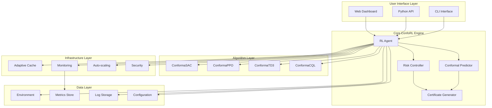
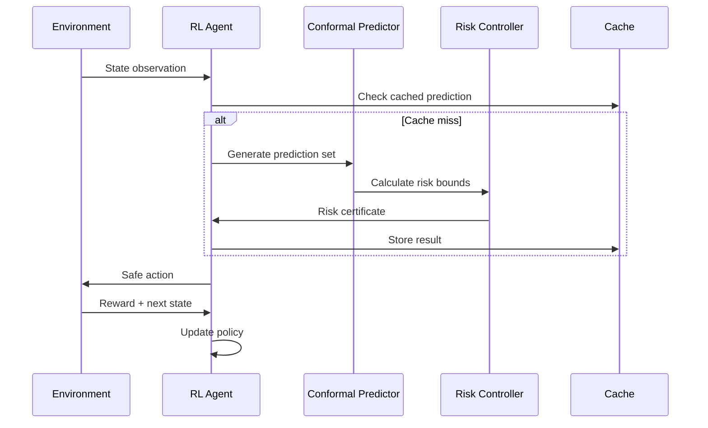
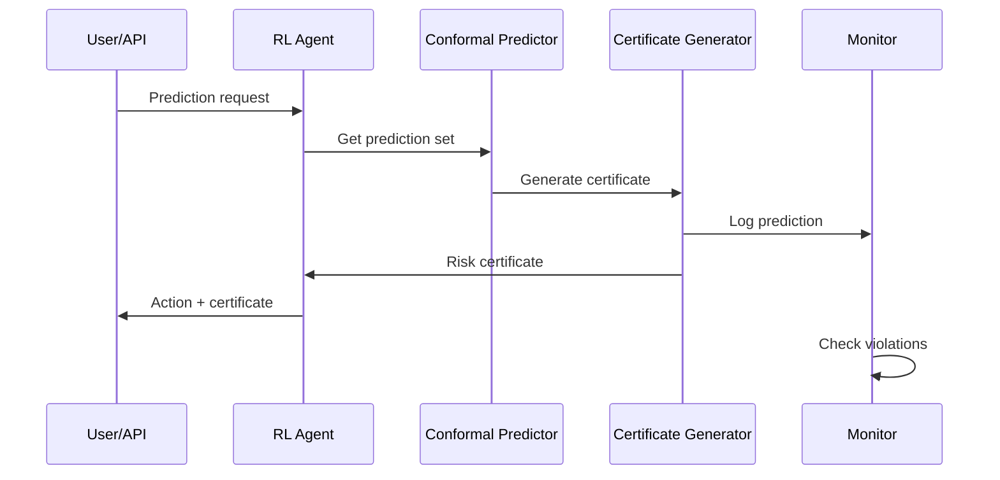
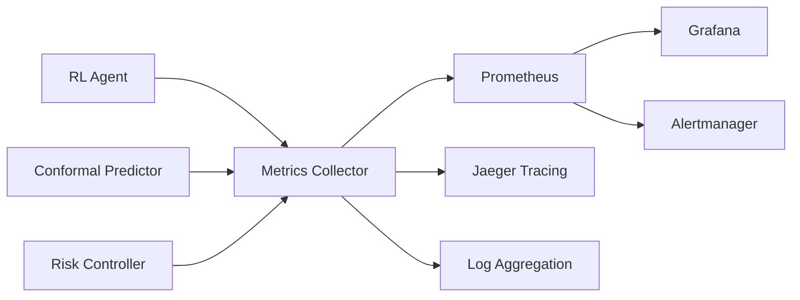

# ConfoRL Architecture

## System Overview

ConfoRL is a research-grade Python library that provides **provable finite-sample safety guarantees** for reinforcement learning through adaptive conformal risk control. The architecture is designed for both research flexibility and production deployment.

## High-Level Architecture



## Component Architecture

### 1. Core Components (`conforl/core/`)

#### Conformal Predictor (`conformal.py`)
- **Purpose**: Implements split conformal prediction for finite-sample guarantees
- **Key Classes**: `ConformalPredictor`, `SplitConformalPredictor`
- **Data Flow**: Raw observations → Prediction sets with coverage guarantees
- **Dependencies**: NumPy, scikit-learn

#### Type System (`types.py`)
- **Purpose**: Centralized type definitions and data structures
- **Key Types**: `RiskCertificate`, `TrajectoryData`, `ConformalConfig`
- **Benefits**: Type safety, serialization, validation

### 2. Algorithm Layer (`conforl/algorithms/`)

#### Base Agent (`base.py`)
- **Purpose**: Abstract base class for all conformal RL algorithms
- **Key Features**: Common interface, risk integration, certificate generation
- **Pattern**: Template method pattern for algorithm implementation

#### Concrete Algorithms
- **ConformaSAC** (`sac.py`): Soft Actor-Critic with conformal guarantees
- **ConformaPPO** (`ppo.py`): Proximal Policy Optimization with risk control
- **ConformaTD3** (`td3.py`): Twin Delayed DDPG with conformal prediction
- **ConformaCQL** (`cql.py`): Conservative Q-Learning for offline RL

### 3. Risk Management (`conforl/risk/`)

#### Risk Measures (`measures.py`)
- **Purpose**: Quantify and control different types of risk
- **Implementations**: CVaR, VaR, expected shortfall, custom measures
- **Interface**: Pluggable risk measure system

#### Risk Controllers (`controllers.py`)
- **Purpose**: Adaptive risk control based on observed data
- **Key Class**: `AdaptiveRiskController`
- **Features**: Online adaptation, confidence bounds, violation tracking

### 4. Deployment Infrastructure (`conforl/deploy/`)

#### Safe Pipeline (`pipeline.py`)
- **Purpose**: Production deployment with safety guarantees
- **Features**: Rollback mechanisms, A/B testing, safety monitoring
- **Pattern**: Pipeline pattern with safety checkpoints

#### Monitoring (`monitor.py`)
- **Purpose**: Real-time risk monitoring and alerting
- **Metrics**: Risk violations, prediction accuracy, system health
- **Integration**: Prometheus, Grafana, custom dashboards

### 5. Performance Optimization (`conforl/optimize/`)

#### Adaptive Caching (`cache.py`)
- **Purpose**: Intelligent caching based on usage patterns
- **Algorithm**: LRU with frequency and recency weighting
- **Benefits**: Reduced computation, faster inference

#### Concurrent Processing (`concurrent.py`)
- **Purpose**: Thread-safe parallel processing
- **Pattern**: Producer-consumer with backpressure
- **Safety**: Thread-local storage, atomic operations

### 6. Security (`conforl/security/`)

#### Access Control (`access_control.py`)
- **Purpose**: Role-based access control for sensitive operations
- **Features**: JWT tokens, permission checking, audit trails

#### Input Validation (`validation.py`)
- **Purpose**: Prevent injection attacks and data corruption
- **Methods**: Schema validation, sanitization, bounds checking

## Data Flow Architecture

### Training Pipeline


### Inference Pipeline


## Scalability Architecture

### Horizontal Scaling
- **Load Balancer**: NGINX/HAProxy for request distribution
- **Agent Replicas**: Stateless agent instances for parallel inference
- **Cache Layer**: Redis cluster for shared prediction cache
- **Database**: PostgreSQL with read replicas for metrics

### Vertical Scaling
- **GPU Acceleration**: CUDA-optimized tensor operations
- **Memory Optimization**: Efficient data structures, memory pooling
- **CPU Optimization**: Vectorized operations, JIT compilation

## Security Architecture

### Defense in Depth
1. **Input Layer**: Validation, sanitization, rate limiting
2. **Application Layer**: Authentication, authorization, encryption
3. **Network Layer**: TLS, network policies, firewall rules
4. **Infrastructure Layer**: Container security, RBAC, audit logging

### Threat Model
- **Input Attacks**: SQL injection, command injection, XSS
- **Model Attacks**: Adversarial examples, model extraction
- **Infrastructure Attacks**: Container escape, privilege escalation
- **Data Attacks**: Data poisoning, privacy leakage

## Monitoring Architecture

### Metrics Collection


### Key Metrics
- **Performance**: Latency, throughput, error rates
- **Safety**: Risk violations, coverage accuracy, confidence intervals
- **Resource**: CPU, memory, GPU utilization
- **Business**: Prediction accuracy, user satisfaction, cost

## Deployment Patterns

### Development Environment
- **Local**: Docker Compose with all services
- **Testing**: Pytest with mocks and fixtures
- **CI/CD**: GitHub Actions with automated testing

### Production Environment
- **Kubernetes**: Orchestration, scaling, service discovery
- **Monitoring**: Prometheus, Grafana, Jaeger
- **Storage**: PostgreSQL, Redis, S3-compatible storage
- **Security**: TLS, RBAC, network policies

## Extension Points

### Custom Algorithms
```python
class CustomConformalAlgorithm(ConformalRLAgent):
    def __init__(self, **kwargs):
        super().__init__(**kwargs)
        # Custom initialization
    
    def _predict_action(self, state):
        # Custom prediction logic
        pass
    
    def _update_policy(self, experience):
        # Custom learning logic
        pass
```

### Custom Risk Measures
```python
class CustomRiskMeasure(RiskMeasure):
    def calculate_risk(self, predictions, targets):
        # Custom risk calculation
        pass
    
    def get_bounds(self, confidence_level):
        # Custom confidence bounds
        pass
```

## Performance Characteristics

### Latency Targets
- **Single Prediction**: <10ms (p99)
- **Batch Prediction**: <50ms for 32 samples
- **Risk Certificate**: <1ms
- **Model Update**: <100ms

### Throughput Targets
- **Predictions/second**: 1000+ per instance
- **Concurrent Users**: 100+ per instance
- **Training Speed**: Real-time capable

### Scalability Limits
- **Horizontal**: 100+ replicas tested
- **Vertical**: 32 CPU cores, 128GB RAM, 8 GPUs
- **Data**: Terabyte-scale trajectory storage

## Quality Attributes

### Reliability
- **Availability**: 99.9% uptime target
- **Fault Tolerance**: Graceful degradation, circuit breakers
- **Recovery**: Automated rollback, health checks

### Maintainability
- **Code Quality**: Type hints, documentation, tests
- **Modularity**: Clean interfaces, dependency injection
- **Extensibility**: Plugin architecture, configuration

### Security
- **Confidentiality**: Encrypted data at rest and in transit
- **Integrity**: Input validation, audit trails
- **Availability**: DDoS protection, rate limiting

## Technology Stack

### Core Technologies
- **Language**: Python 3.8+
- **ML Framework**: PyTorch, scikit-learn
- **RL Library**: Gymnasium, Stable-Baselines3
- **Web Framework**: FastAPI (future)

### Infrastructure
- **Containerization**: Docker, Docker Compose
- **Orchestration**: Kubernetes
- **Monitoring**: Prometheus, Grafana, Jaeger
- **Storage**: PostgreSQL, Redis, S3

### Development Tools
- **Testing**: pytest, coverage
- **Linting**: black, isort, mypy
- **CI/CD**: GitHub Actions
- **Documentation**: Sphinx, MkDocs

This architecture provides a solid foundation for the ConfoRL library, balancing research flexibility with production requirements while maintaining strong safety and security guarantees.